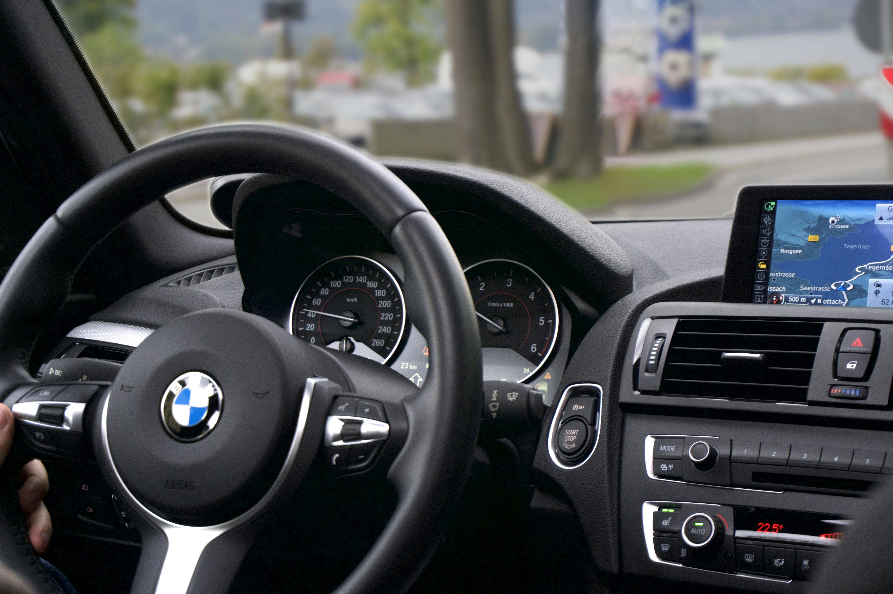

# iBuild Automative: The Dream Team Consultation 

As part of our collaboration with emerging machine manufacturer iBuild Automotive, we have been tasked with developing a predictive image recognition system that will be used to allow iBuild Automotive to create autonomous vehicles. Our goal is to make a model that has enough intelligence to accurately identify other vehicle types such as airplanes, automobiles, ships, and trucks. We aim to have these vehicles navigate various, dynamic environments with the ability to avoid collision with objects in their surroundings.

# Data Dictionary

|Features|Type|Dataset|Description|
|---|---|---|---|
|deer|img|Keras CIFAR10|Image model needs to accurately predict| 

For a more detailed dictionary, review the Keras CIFAR10 dataset by [clicking here](https://keras.io/api/datasets/cifar10/)

# Executive Summary

##### Background: 
We are The Dream Team. A group of data scientists who specialize in supervised machine learning algorithms. We have contracted out our services to a machine manufacturer named iBuild Automotive who is building self-driving cars. It is our job to predict images that pose as obstacles for the manufactured self-driving vehicles. For example: deers for cars, birdds for planes, and vehicles for other vehicles. Our partnered focus is to have self-driving vehicles on the road that have the least faults and high efficiency. Road safety is a very important mission for our consultant group, as well as for iBuild Automotive.

##### Methodology: 

Using machine modeling and convolutional neural networks, our model building approach was:

- Establishing a baseline with a simple feed forward model.
- Creating a more complex model with 3 convolution layers with 16-32 filters per layer, we added padding to capture the corners, then fed it to a 2 layer NN using relu, softmax as activation functions  and Adam optimizer
- Building a final model where we doubled our convolution layers and increase our filters to 32 and 64, then fed it into 3 layer fully connected ANN again using dropout,  relu, softmax and Adam.

##### Key Findings:
Our model shows promising results in accurately identifying objects in diverse environments. We achieved an accuracy score of 71% indicating that for 6 out of 10 images, our detection system had a probability of being correct more than 50% of the time. Evaluation of the confusion matrix showed good differentiation between vehicle and non-vehicle classes and between different types of vehicles. The model had the most difficulty distinguishing between similar animals, such as cats and dogs. 

##### Next Steps?
We will continue to fulfill contracts with iBuild Automotive where more examples of objects will be introduced to our detection system, increasing the model’s ability to capture images more accurately. 

# Sources
CIFAR10 small images classification dataset by Keras
